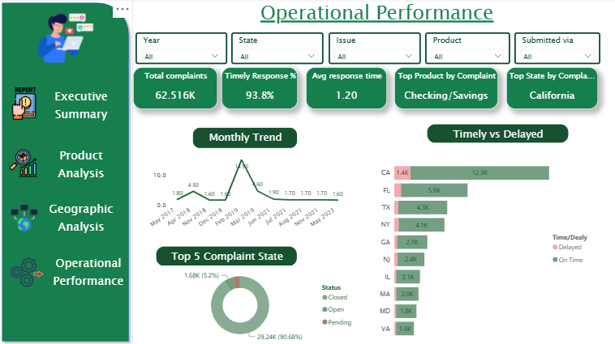

# Customer-Complaints-Analysis-Dashboard
An interactive multi-page Power BI dashboard analyzing 62,516+ customer complaints, covering product trends, geographic distribution, and operational performance for a financial services company.

-Overview
This dashboard helps stakeholders quickly answer:
Where are complaints concentrated geographically?
Which products and sub-products generate the most complaints?
How responsive is the company in resolving complaints?
What's the trend over time, and where are the bottlenecks?

The report is split into 4 interactive pages, all connected through shared slicers (Year, State, Issue, Product, Submitted via).

- Tools & Techniques Used

Power BI
DAX measures for KPIs (Total Complaints, Timely Response %, Avg Response Time)
Interactive slicers synced across pages
Donut, Treemap, Bar, and Line charts
Custom report navigation with icon-based menu
Conditional formatting (Timely vs Delayed comparisons)

- Dashboard Pages

1. Executive Summary

High-level KPIs and trends at a glance.

Total Complaints: 62.516K
Timely Response Rate: 93.8%
Avg Response Time: 1.20 days
Top Product by Complaint: Checking/Savings
Top State by Complaint: California
Monthly trend line shows a sharp spike around mid-2023
Checking/Savings accounts lead complaint volume (25K), followed by Credit Card (16K) and Credit Reporting (8K)

2. Product Analysis

Breaks down complaints by product and sub-product over time.

Sub-issue breakdown shows "Deposits and withdrawals" as the leading complaint driver (5.6K)
Top 5 sub-products: Checking accounts (43.41%) dominate, followed by General-purpose cards (15.34%)
Multi-year product trend (2018–2022) highlights shifting complaint patterns across product lines

3. Geographic Analysis

Visualizes complaint density across U.S. states.

State heatmap (treemap): California (14K) and Florida (6K) are the largest contributors
Regional trend chart: CA (13.7K) far outpaces FL (6.5K), TX (4.7K), NY (2.9K), and other states

4. Operational Performance

Tracks resolution speed and complaint status.

90.68% of complaints are Closed, 5.2% Pending, with a small remainder Open
Timely vs Delayed comparison by state — California has the highest delayed volume (1.4K) despite high overall closure
Monthly trend (2017–2023) shows a major spike in complaint volume around Feb 2019

- Interactive Filters (Slicers, applied across all pages)

Year
State
Issue
Product
Submitted via

- How to Use

Download `customer-complaint-dashboard.pbix`
Open in Power BI Desktop (free download from Microsoft)
Use the slicers at the top of each page to filter by Year, State, Issue, Product, or Submission channel
Navigate between pages using the left-side menu (Executive Summary, Product Analysis, Geographic Analysis, Operational Performance)
